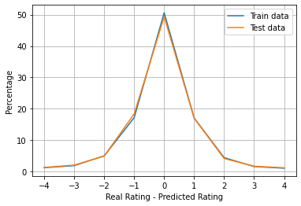
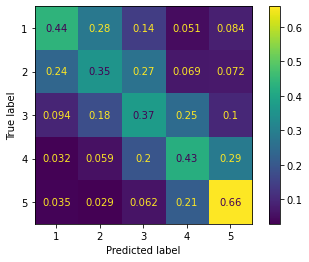

# Predicting review numeric ratings based exclusively on the text of the review

Given a text review, can we guess, from 1 to 5 stars, which is the score of the review? We certainly can estimate it roughly.

I downloaded from the [Amazon Review Data (2018)](https://nijianmo.github.io/amazon/index.html) the small book subset to perform this exercise. I created a MongoDB collection for this dataset and designed an exercise for learning purposes.

The objective then is, converting each review to [TF-IDF vectors](https://towardsdatascience.com/tf-idf-for-document-ranking-from-scratch-in-python-on-real-world-dataset-796d339a4089) and to use a Machine Learning algorithm using these features to predict the numeric rating of the review.

The "small" book review dataset consists of 27,164,983 reviews. Stored it in a MongoDB collection, and using `pymongo` I loaded a random subset of reviews. This is because I am working with a laptop and hence I can't work with massive datasets.

I worked on this exercise from the [simplest Logistic Regression model](simple_logisitc_regression.ipynb), following by [reducing the dimensionality of the problem](svd_dim_reduct.ipynb) and ending exploring [different machine learning algorithms](pipeline_multi_ml.ipynb).

## [Simple model using Logistic Regression](simple_logisitc_regression.ipynb)

The text of the review is cleaned removing punctuation, lemmatizing the text and stopwords. 

Before processing more, I divided the dataset into train and test samples. This is because certain preprocessing techniques lead to [data leakage](https://machinelearningmastery.com/data-leakage-machine-learning/), and hence the trained models could be too optimistic.

Then I obtain the TF-IDF vectors for each review. By simply applying the Logistic Regression model, we obtain fairly good results, but with overfitting signs.

## [Reducing the number of features](svd_dim_reduct.ipynb)

The TF-IDF vectors have ~20,000 dimensions, so we can test whether we can reduce the number of them and solve the overfitting problem.

I ‘ve chosen the Truncated SVD method as it can be used with the database dimensions that I'm handling in my computer (PCA did not work in this case).

Using 3500 dimensions we can encapsulate 80% of the variance, but the overfitting persists. By checking different numbers of dimensions we can see that we can reduce the dimensions up to 500 obtaining similar results without overfitting (the original approach with the TF-IDF vectors had ~20,000 features!).

## [Choosing the best ML method](pipeline_multi_ml.ipynb)

Finally, I created a Python Class classifier (with its `.fit(X,y)`, `.predict(X)`, `.predict_proba(X)` and `.score(X,y)` functions as any other classifier) that is initialized by analyzing among a set of ML classifiers the one that has a better performance on the train dataset. Among each ML method, the class also performs a grid search to obtain the best hyperparameters by performing different fits using cross validation.

This allows to obtain the best approach to predict the Amazon books review ratings using the TF-IDF features. The performance of this method can be visualized in the following histogram and by obtaining the confusion matrix:

The confusion matrix of the test sample (normalized to the true ratings):

## Final thoughts

This is just an approach that certainly can be improved, but very useful as a Natural Language Processing exercise to learn, so feel free to fork it and practice by yourself! And feedback is always welcome :)
